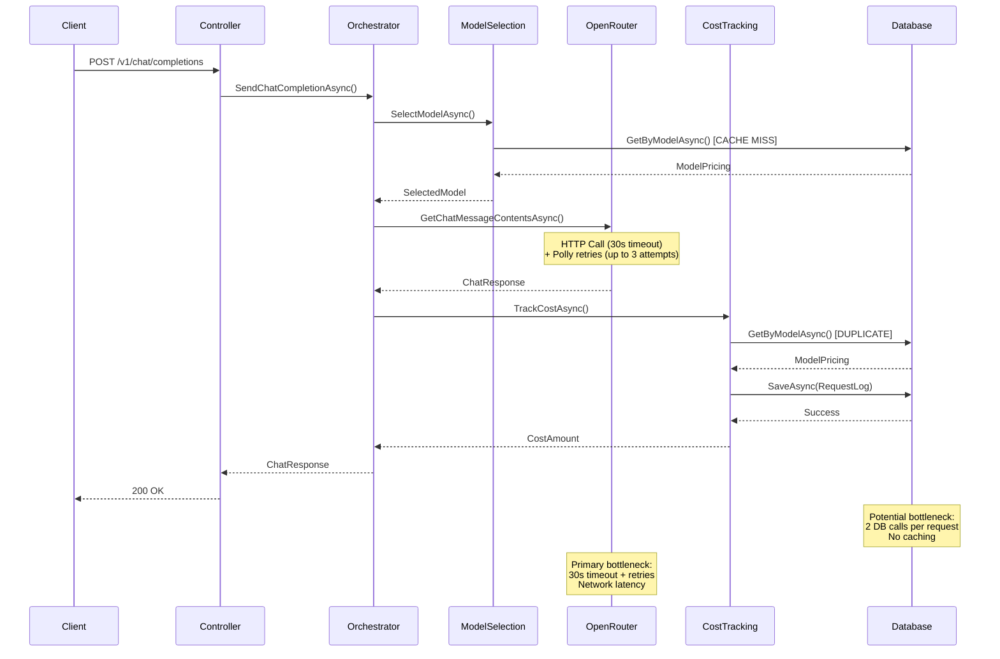

# LLMGateway Performance Analysis: Potential Bottlenecks

## Summary of Findings

After analyzing the codebase, I've identified several potential bottlenecks that could cause timeouts and slow responses. The main issues are related to external API dependencies, database operations, and retry/fallback logic.

## Key Bottlenecks Identified

### 1. **External API Timeouts (Primary Cause of Timeouts)**
- **HttpClient timeout**: 30 seconds per request
- **Polly retry policy**: Up to 3 attempts with exponential backoff (1s, 2s, 4s delays)
- **Total potential delay**: Single failed request can take up to 37 seconds (30s + 7s retry delays)
- **Circuit breaker**: Additional 30-second cooldown when threshold reached
- **Issue**: When OpenRouter API is slow or unresponsive, requests timeout without clear error messages

### 2. **Database Operations (Performance Impact)**
- **Cost tracking**: Every request makes 2 DB calls (pricing lookup + log save)
- **Model selection**: DB query for pricing on every request
- **No caching**: Model pricing fetched fresh each time
- **Issue**: DB latency directly impacts response time

### 3. **Sequential Processing**
- **Request flow**: Model selection → API call → Cost tracking (all sequential)
- **Fallback attempts**: Up to 3 different models tried sequentially
- **Issue**: No parallelization or optimization of the pipeline

### 4. **Health Check Overhead**
- **OpenRouter health check**: Makes HTTP calls to `/models` endpoint
- **Timeout**: 5 seconds per health check
- **Issue**: Health checks can slow down if API is degraded

### 5. **Logging Overhead**
- **Debug logging**: Token extraction methods log debug info on every request
- **Issue**: If debug logging enabled, adds I/O overhead

## Recommendations

### Immediate Fixes
1. **Reduce HttpClient timeout** from 30s to 15-20s
2. **Implement caching** for model pricing (in-memory cache with TTL)
3. **Add request timeout** at API controller level (10-15s total)
4. **Optimize retry policy** - reduce max attempts or adjust backoff

### Medium-term Improvements
1. **Parallelize operations** where possible (e.g., start cost tracking async)
2. **Add circuit breaker monitoring** and better error messages
3. **Implement response streaming** for long-running requests
4. **Add performance metrics** and monitoring

### Long-term Architecture
1. **Queue-based processing** for non-real-time requests
2. **Load balancing** across multiple LLM providers
3. **Response caching** for similar requests
4. **Database optimization** (connection pooling, query optimization)

### Monitoring & Debugging
1. **Add timeout tracking** in logs
2. **Implement distributed tracing** (correlation IDs already in place)
3. **Add performance counters** for each pipeline step
4. **Better error messages** for timeout scenarios

## Code Locations to Review
- `OpenRouterChatCompletionService.cs`: HttpClient configuration
- `PollyPolicies.cs`: Retry and circuit breaker settings
- `CostTrackingPlugin.cs`: Database operations
- `KernelOrchestrator.cs`: Sequential processing logic
## Request Flow Diagram

- `ProviderHealthChecker.cs`: Health check implementation